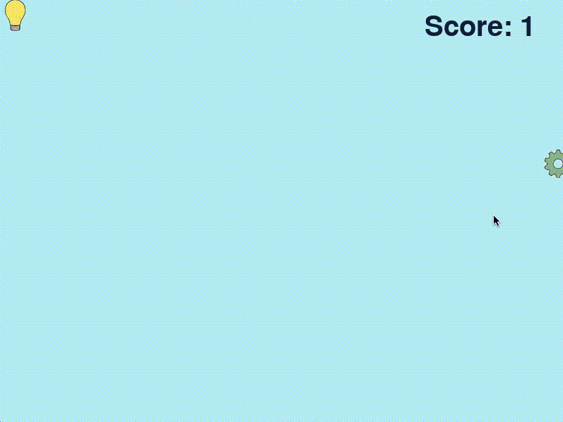

## tech-workshop-f20

This repository contains the resources that were used for a ***Code Your First Game*** workshop hosted by **University of Waterloo Women in STEM** on November 10th, 2020.

The [game-resources](https://github.com/uwWiSTEM/tech-workshop-f20/tree/main/game-resources) folder contains all of the starter resources that were provided to attendees.

The [MyFirstGame](https://github.com/uwWiSTEM/tech-workshop-f20/tree/main/MyFirstGame) folder contains the resources for the final game which participants would finish with at the end of the workshop.

Slides which were used in the workshop, containing steps for how to build the game can be found [here](https://docs.google.com/presentation/d/1Kf6n417ec22val1-np00Cb-RrM3Y-P8A5uUl2_zCtes/edit?usp=sharing).

### Game Demo

